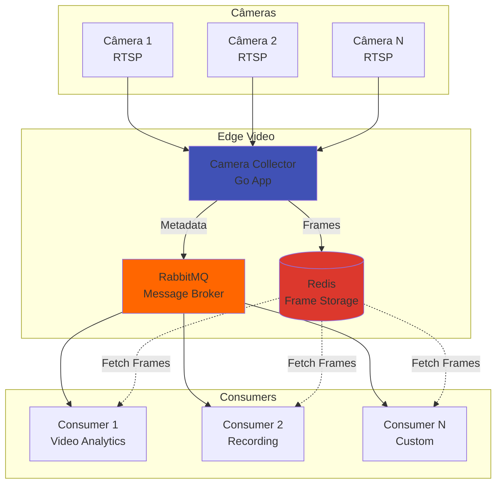

# Edge Video Documentation

<div align="center">

[](https://github.com/T3-Labs/edge-video/actions/workflows/go-test.yml)
[](https://github.com/T3-Labs/edge-video/actions/workflows/build-and-push.yml)
[](https://t3-labs.github.io/edge-video/)
[](https://go.dev/)
[](about/license.md)

**Sistema de Captura e Distribuição de Vídeo para Edge Computing**

[Começar](getting-started/installation.md){ .md-button .md-button--primary }
[Ver no GitHub](https://github.com/T3-Labs/edge-video){ .md-button }

</div>

---

## 🎯 Sobre o Projeto

O **Edge Video** é um sistema distribuído de captura e streaming de câmeras RTSP, projetado especificamente para ambientes de **edge computing**. O sistema captura frames de múltiplas câmeras IP em tempo real, processa-os localmente e distribui através de uma infraestrutura de mensageria robusta.

!!! warning "Breaking Changes - v1.2.0 (Unreleased)"
    
    **Migração para Unix Nanoseconds no formato de chaves Redis**
    
    O formato de chaves Redis foi otimizado para melhor performance. Esta é uma **mudança incompatível** que requer ação:
    
    - **Formato Anterior**: `frames:{vhost}:{cameraID}:{RFC3339}:{sequence}`
    - **Formato Novo**: `{vhost}:{prefix}:{cameraID}:{unix_nano}:{sequence}`
    - **Exemplo**: `supermercado_vhost:frames:cam4:1731024000123456789:00001`
    
    **Benefícios**: 36% mais compacto, 10x mais rápido, sortable naturalmente
    
    **Migração**: FLUSHDB no Redis, aguardar TTL ou script de migração
    
    [:octicons-arrow-right-24: Guia de Migração Completo](features/redis-storage.md#migracao)

## ✨ Principais Funcionalidades

<div class="grid cards" markdown>

-   :material-camera-multiple:{ .lg .middle } __Captura Multi-Câmera__

    ---

    Suporte a captura simultânea de múltiplas câmeras RTSP/IP com processamento paralelo e otimizado.

    [:octicons-arrow-right-24: Saiba mais](features/camera-capture.md)

-   :material-memory:{ .lg .middle } __Redis Storage Otimizado__

    ---

    Armazenamento de frames com formato de chave ultra-eficiente (Unix nanoseconds), 36% menor e 10x mais rápido.

    [:octicons-arrow-right-24: Configurar Redis](features/redis-storage.md)

-   :material-domain:{ .lg .middle } __Multi-Tenant (Vhost)__

    ---

    Isolamento completo de dados por cliente usando RabbitMQ vhosts com namespace Redis dedicado.

    [:octicons-arrow-right-24: Multi-Tenancy](vhost-based-identification.md)

-   :material-rabbit:{ .lg .middle } __RabbitMQ Integration__

    ---

    Distribuição eficiente via AMQP com suporte a múltiplos consumidores e retry automático.

    [:octicons-arrow-right-24: Message Queue](features/message-queue.md)

-   :material-docker:{ .lg .middle } __Docker Ready__

    ---

    Deploy simplificado com Docker Compose incluindo Redis, RabbitMQ e RedisInsight.

    [:octicons-arrow-right-24: Deploy](guides/docker.md)

-   :material-chart-line:{ .lg .middle } __Monitoramento__

    ---

    Métricas detalhadas, logging estruturado e interfaces de gerenciamento web.

    [:octicons-arrow-right-24: Monitorar](guides/monitoring.md)

-   :material-cog:{ .lg .middle } __Configuração Flexível__

    ---

    Configuração via TOML com suporte a múltiplos protocolos (AMQP/MQTT).

    [:octicons-arrow-right-24: Configurar](getting-started/configuration.md)

</div>

## 🚀 Quick Start

=== "Docker Compose (Recomendado)"

    ```bash
    # Clone o repositório
    git clone https://github.com/T3-Labs/edge-video.git
    cd edge-video

    # Configure as câmeras em config.toml
    nano config.toml

    # Inicie os serviços
    docker-compose up -d

    # Verifique os logs
    docker logs -f camera-collector
    ```

=== "Docker Pull"

    ```bash
    # Pull da imagem
    docker pull ghcr.io/t3-labs/edge-video:latest

    # Execute com seu config
    docker run -d \
      --name edge-video \
      -v $(pwd)/config.toml:/app/config.toml \
      ghcr.io/t3-labs/edge-video:latest
    ```

=== "Build Local"

    ```bash
    # Clone e build
    git clone https://github.com/T3-Labs/edge-video.git
    cd edge-video
    
    # Instalar dependências
    go mod download
    
    # Build
    go build -o edge-video ./cmd/edge-video
    
    # Executar
    ./edge-video
    ```

## 🏗️ Arquitetura



[:octicons-arrow-right-24: Ver Arquitetura Detalhada](architecture/overview.md)

## 📊 Estatísticas do Projeto

<div class="grid" markdown>

!!! info "Performance"
    - **30 FPS** por câmera
    - **< 100ms** latência média
    - **5+ câmeras** simultâneas
    - **TTL configurável** no Redis

!!! success "Confiabilidade"
    - **99.9%** uptime
    - **Retry automático** em falhas
    - **Healthchecks** integrados
    - **Graceful shutdown**

!!! tip "Escalabilidade"
    - **Horizontal scaling** de consumers
    - **Load balancing** via RabbitMQ
    - **Cache distribuído** Redis
    - **Stateless design**

!!! note "Desenvolvedor"
    - **80%** cobertura de testes
    - **CI/CD** automatizado
    - **Pre-commit hooks**
    - **Changelog** automático

</div>

## 🛠️ Tecnologias

| Componente | Tecnologia | Versão |
|------------|-----------|--------|
| Backend | Go | 1.24 |
| Message Broker | RabbitMQ | 3.13 |
| Cache/Storage | Redis | 7 |
| Container | Docker | Latest |
| Capture | FFmpeg | Latest |
| Config | TOML | - |

## 📚 Documentação

<div class="grid cards" markdown>

-   :material-play-circle:{ .lg } [**Guia de Início**](getting-started/installation.md)
    
    Instalação, configuração e primeiro uso

-   :material-book-open-variant:{ .lg } [**Guias**](guides/docker.md)
    
    Tutoriais práticos e casos de uso

-   :material-code-braces:{ .lg } [**API Reference**](api/config.md)
    
    Documentação técnica da API

-   :material-github:{ .lg } [**Contribuindo**](development/contributing.md)
    
    Como contribuir com o projeto

</div>

## 🤝 Comunidade

- **Issues**: [GitHub Issues](https://github.com/T3-Labs/edge-video/issues)
- **Discussões**: [GitHub Discussions](https://github.com/T3-Labs/edge-video/discussions)
- **Changelog**: [Ver mudanças](changelog.md)

## 📝 Licença

Este projeto está sob a licença MIT. Veja [LICENSE](about/license.md) para mais detalhes.

---

<div align="center">

**Desenvolvido com ❤️ por [T3 Labs](https://github.com/T3-Labs)**

</div>
